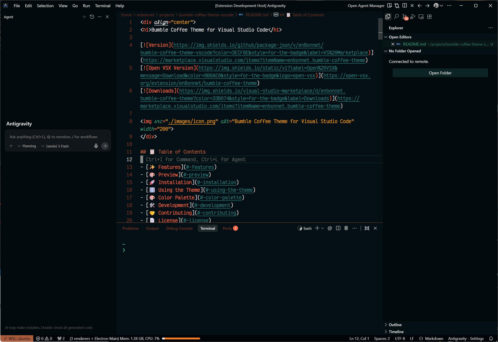
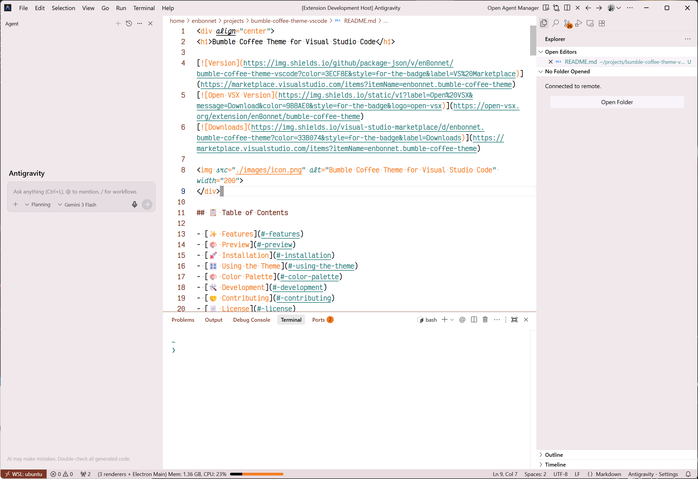

<div align="center">
<h1>Bumble Coffee Theme for Visual Studio Code</h1>

[](https://marketplace.visualstudio.com/items?itemName=enbonnet.bumble-coffee-theme)
[](https://open-vsx.org/extension/enBonnet/bumble-coffee-theme)
[](https://marketplace.visualstudio.com/items?itemName=enbonnet.bumble-coffee-theme)


</div>

## 📋 Table of Contents

- [✨ Features](#-features)
- [🎨 Preview](#-preview)
- [🚀 Installation](#-installation)
- [🎛️ Using the Theme](#-using-the-theme)
- [🎨 Color Palette](#-color-palette)
- [🛠️ Development](#-development)
- [🤝 Contributing](#-contributing)
- [📄 License](#-license)
- [💖 Credits](#-credits)

## ✨ Features

- 🎨 Beautiful dark and light theme inspired by the layers of a Bumble Coffee
- 👀 Optimized for high contrast and readability
- 🖥️ Supports all major programming languages
- 🌙 Two variants: Standard and Light

## ☕ The Inspiration

The **Bumble Coffee Theme** is a vibrant yet professional VS Code theme inspired by the refreshing layers of a **Bumble Coffee** (also known as an Espresso Orange). This theme captures the beautiful aesthetic of dark espresso merging with bright orange juice, providing a high-contrast experience that is easy on the eyes during long coding sessions.

### What is a Bumble Coffee?

A Bumble Coffee is a refreshing, layered coffee drink that has become a staple in modern specialty cafes. It is typically prepared with:
- **Caramel or Chocolate Syrup** at the bottom (optional)
- **Ice cubes**
- **Fresh Orange Juice** (forming the bright yellow/orange base)
- **Double shot of Espresso** poured gently over the top (forming the dark cap)

The result is a visually stunning drink with distinct "bumblebee" stripes—vibrant orange and deep coffee brown—which are the core inspiration for this theme's color palette.

## 🎨 Preview

### Dark Theme
<div align="center">

</div>

### Light Theme
<div align="center">

</div>

## 🎨 Color Palette

This theme uses a coffee-inspired color palette derived directly from the bumble coffee aesthetics:

| Role | Color | Hex | Preview |
|------|-------|-----|---------|
| Background | Dark Espresso | `#051014` |  |
| Foreground | Silver Fog | `#E8E8E8` |  |
| Selection | Deep Roast | `#0D2424` |  |
| Comments | Coffee Bean | `#7C3626` |  |
| Cyan | Muted Teal | `#2A7F7F` |  |
| Green | Vibrant Mint | `#3A9F7F` |  |
| Orange | Fresh Citrus | `#F47C20` |  |
| Red | Soft Cherry | `#E05545` |  |
| Purple | Roasted Cocoa | `#A85A3A` |  |
| Yellow | Golden Crema | `#F4A020` |  |

### UI Variants

| Variable | Hex | Purpose |
|----------|-----|---------|
| BGDarker | `#010508` | Deepest espresso |
| BGDark | `#030A0D` | Dark panels/sidebars |
| BG | `#051014` | Main editor background |
| BGLight | `#0A1A20` | Mid-tone foam |
| BGLighter | `#0D2424` | Hover states/highlights |

### ANSI Terminal Colors

| ANSI | Name | Hex | Bright Hex |
|------|------|-----|------------|
| 0/8 | Black | `#030A0D` | `#7C3626` |
| 1/9 | Red | `#E05545` | `#FF7A65` |
| 2/10 | Green | `#3A9F7F` | `#4DBF9F` |
| 3/11 | Yellow | `#F4A020` | `#FFB84A` |
| 4/12 | Blue | `#2A7F7F` | `#3A9F9F` |
| 5/13 | Magenta | `#FF6B4A` | `#FF8565` |
| 6/14 | Cyan | `#2A7F7F` | `#4DBFBF` |
| 7/15 | White | `#E8E8E8` | `#FFFFFF` |

## 🚀 Installation

### VS Code Marketplace
[](https://marketplace.visualstudio.com/items?itemName=enbonnet.bumble-coffee-theme)

### Open VSX Registry
[](https://open-vsx.org/extension/enBonnet/bumble-coffee-theme)

## 🎨 Using the Theme

1. Open the Command Palette (`Ctrl+Shift+P` or `Cmd+Shift+P`)
2. Type "Preferences: Color" and press Enter
3. Search for "Bumble Coffee"
4. Select either "Bumble Coffee" or "Bumble Coffee Light" from the list

### Recommended Settings

For the best experience, add these to your `settings.json`:

```json
{
  "workbench.colorTheme": "Bumble Coffee Theme",
  "editor.fontFamily": "'Victor Mono', Monaco, Menlo, 'Courier New', monospace",
  "editor.fontSize": 16,
  "editor.lineHeight": 1.5,
  "editor.fontWeight": "600",
  "editor.wordWrap": "on",
}
```

- [Victor Mono](https://rubjo.github.io/victor-mono/)

## 🎨 Theme Variants

- **Bumble Coffee** - Standard version with vibrant colors
- **Bumble Coffee Light** - Softer, desaturated version for reduced eye strain

## 🛠 Development

### Prerequisites

- [Node.js](https://nodejs.org/) (v18+)
- [pnpm](https://pnpm.io/) or npm

### Setup

```bash
# Install dependencies
pnpm install

# Build the theme
pnpm run build

# Package the extension
pnpm run package
```

### Project Structure

```
├── src/
│   └── bumble-coffee.yml      # Theme source file (YAML)
├── theme/
│   ├── bumble-coffee.json     # Generated theme
│   └── bumble-coffee-light.json
├── scripts/
│   ├── build.js          # Build script
│   └── generate.js       # Theme generator
└── images/
    └── icon.png          # Extension icon
```

## 🤝 Contributing

Contributions are welcome! If you find any issues or have suggestions for improvements, please feel free to:

1. Open an [issue](https://github.com/enbonnet/bumble-coffee-theme-vscode/issues)
2. Submit a pull request
3. Share your feedback

## 📬 Stay Updated

For updates, star this repository and follow me on [GitHub](https://github.com/enbonnet).

## 💖 Credits

- Inspired by the refreshing colors of a Bumble Coffee drink
- Special thanks to the VS Code community for their amazing theming support
- This theme is based on the [Dracula Theme](https://draculatheme.com/) schema, with colors adapted from the Bumble Coffee drink aesthetics.
- Thanks to all contributors who help improve this theme

## 📄 License

This project is licensed under the MIT License - see the [LICENSE](LICENSE) file for details.

---

<div align="center">
Made with ☕ by <a href="https://enbonnet.com">Ender Bonnet</a>
</div>

