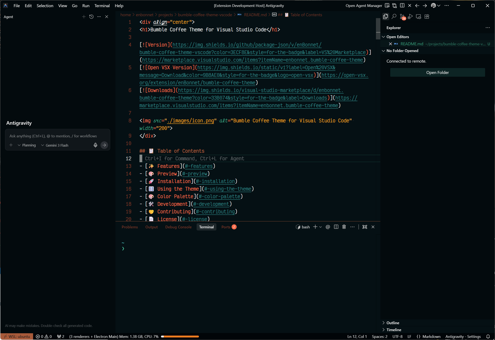
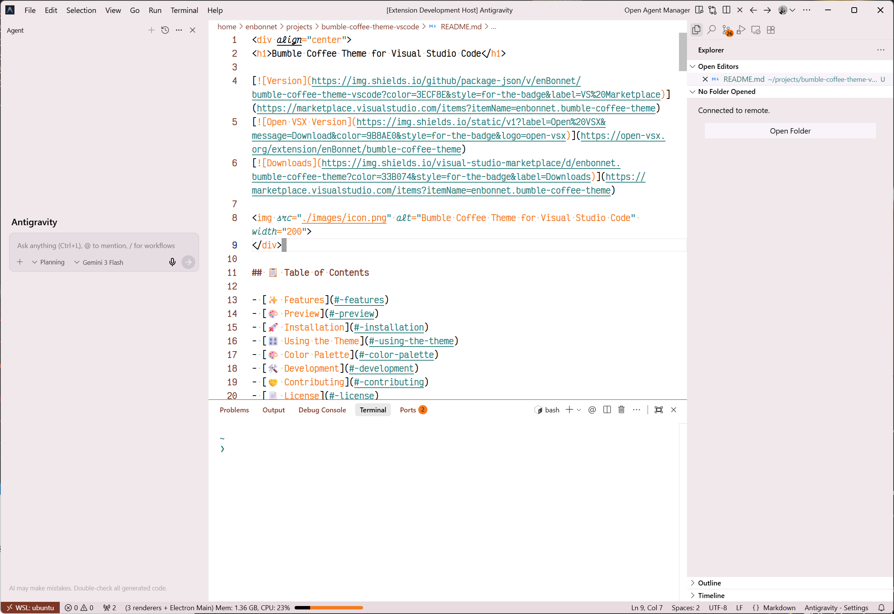

<div align="center">

<h1>Bumble Coffee Theme</h1>

[](https://marketplace.visualstudio.com/items?itemName=enbonnet.bumble-coffee-theme)
[](https://open-vsx.org/extension/enBonnet/bumble-coffee-theme)
[](https://marketplace.visualstudio.com/items?itemName=enbonnet.bumble-coffee-theme)


</div>

## Table of Contents

- [Features](#features)
- [Preview](#preview)
- [Color Palette](#color-palette)
- [UI Variants](#ui-variants)
- [ANSI Terminal Colors](#ansi-terminal-colors)
- [Supported Languages](#supported-languages)
- [Installation](#installation)
- [Using the Theme](#using-the-theme)
- [Recommended Settings](#recommended-settings)
- [Development](#development)
- [Contributing](#contributing)
- [Credits](#credits)
- [License](#license)

## Features

- **Two distinct variants** — A rich dark theme ("Bumble Coffee") and a softer light theme ("Bumble Coffee Light"), both inspired by the layered espresso-and-orange aesthetic of a Bumble Coffee drink.
- **High contrast and readability** — Carefully tuned foreground-background ratios keep code legible during long sessions, with a deep espresso background (`#051014`) and a soft silver foreground (`#E8E8E8`).
- **Semantic highlighting across 30+ languages** — Explicit TextMate scoping rules for JavaScript, TypeScript, Python, Rust, Go, Java, PHP, Ruby, Swift, GraphQL, and many more.
- **Eye comfort** — Low-blue-light dark tones, restrained accent saturation, and a warm-coffee palette that avoids harsh neon glare.

## Preview

### Dark Theme
<div align="center">
  
</div>

### Light Theme
<div align="center">
  
</div>

## Color Palette

| Role | Color | Hex | Preview |
|------|-------|-----|---------|
| Background | Dark Espresso | `#051014` |  |
| Foreground | Silver Fog | `#E8E8E8` |  |
| Selection | Deep Roast | `#0D2424` |  |
| Comment | Coffee Bean | `#7C3626` |  |
| Cyan | Muted Teal | `#2A7F7F` |  |
| Green | Vibrant Mint | `#3A9F7F` |  |
| Orange | Fresh Citrus | `#F47C20` |  |
| Pink | Warm Coral | `#FF6B4A` |  |
| Purple | Roasted Cocoa | `#A85A3A` |  |
| Red | Soft Cherry | `#E05545` |  |
| Yellow | Golden Crema | `#F4A020` |  |

## UI Variants

| Variable | Hex | Purpose |
|----------|-----|---------|
| `BGDarker` | `#010508` | Deepest espresso — status bar, inactive title bar |
| `BGDark` | `#030A0D` | Dark panels — sidebar, widgets |
| `BG` | `#051014` | Main editor background |
| `BGLight` | `#0A1A20` | Mid-tone foam — activity bar, input backgrounds |
| `BGLighter` | `#0D2424` | Hover states and selection highlights |

## ANSI Terminal Colors

| ANSI | Name | Normal | Bright |
|------|------|--------|--------|
| 0 / 8 | Black | `#030A0D`  | `#7C3626`  |
| 1 / 9 | Red | `#E05545`  | `#FF7A65`  |
| 2 / 10 | Green | `#3A9F7F`  | `#4DBF9F`  |
| 3 / 11 | Yellow | `#F4A020`  | `#FFB84A`  |
| 4 / 12 | Blue | `#2A7F7F`  | `#3A9F9F`  |
| 5 / 13 | Magenta | `#FF6B4A`  | `#FF8565`  |
| 6 / 14 | Cyan | `#2A7F7F`  | `#4DBFBF`  |
| 7 / 15 | White | `#E8E8E8`  | `#FFFFFF`  |

## Supported Languages

| Language | Explicit TextMate Scopes |
|----------|--------------------------|
| C | `storage.type.c` |
| C# | `punctuation.definition.tag.cs`, `keyword.type.cs`, `storage.type.cs` |
| CoffeeScript | `punctuation.section.embedded.coffee`, `meta.variable.assignment.destructured.object.coffee variable` |
| CSS | `punctuation.separator.list.comma.css` |
| Go | `source.go storage.type` |
| GraphQL | `meta.selectionset.graphql variable`, `punctuation.colon.graphql`, `entity.name.fragment.graphql`, `variable.fragment.graphql` |
| Groovy | `meta.method.groovy`, `source.groovy storage.type`, `keyword.operator.navigation.groovy` |
| Haskell | `storage.type.haskell`, `constant.language.empty-list.haskell`, `meta.preprocessor.haskell` |
| Java | `meta.method-call.java meta.method`, `source.java storage.type`, `keyword.operator.dereference.java` |
| JavaScript | `variable.other.constant.js`, `punctuation.section.embedded.begin.jsx`, `punctuation.section.embedded.end.jsx` |
| Lua | `support.function.any-method.lua` |
| Makefile | `punctuation.definition.variable.makefile`, `entity.name.function.target.makefile`, `meta.scope.prerequisites.makefile` |
| Markdown | `beginning.punctuation.definition.list.markdown`, `markup.fenced_code.block.markdown`, `markup.heading.markdown`, `meta.paragraph.markdown` |
| OCaml | `storage.type.ocaml` |
| Objective-C | `storage.type.objc`, `meta.implementation storage.type.objc`, `meta.protocol-list.objc` |
| Perl | `constant.other.key.perl` |
| PHP | `meta.function-call.php`, `meta.function.arguments variable.other.php`, `storage.type.php` |
| PowerShell | `keyword.operator.other.powershell`, `source.powershell entity.other.attribute-name` |
| Python | `string.quoted.docstring.multi.python` |
| Ruby | `variable.other.readwrite.instance.ruby`, `constant.other.symbol.hashkey.ruby` |
| Rust | `storage.class.std.rust`, `storage.type.core.rust` |
| SCSS | `meta.attribute-selector.scss`, `punctuation.definition.attribute-selector.begin.bracket.square.scss` |
| Shell (Bash) | `meta.scope.for-loop.shell`, `source.shell variable.other` |
| Swift | `keyword.expressions-and-types.swift`, `keyword.primitive-datatypes.swift`, `storage.type.attribute.swift` |
| TOML | `meta.group.toml`, `entity.name.section.toml`, `variable.other.key.toml` |
| TypeScript | `variable.other.constant.ts` |
| TypeScript (TSX) | `variable.other.constant.tsx`, `punctuation.section.embedded.begin.tsx`, `punctuation.section.embedded.end.tsx` |
| YAML | `punctuation.definition.block.sequence.item.yaml`, `entity.name.tag.yaml`, `variable.other.alias.yaml` |
| reStructuredText | `punctuation.definition.link.restructuredtext`, `entity.name.directive.restructuredtext` |

> Additional languages are covered by general-purpose scoping rules that handle identifiers, keywords, strings, comments, and punctuation across all TextMate grammars.

## Installation

### VS Code Marketplace
[](https://marketplace.visualstudio.com/items?itemName=enbonnet.bumble-coffee-theme)

### Open VSX Registry
[](https://open-vsx.org/extension/enBonnet/bumble-coffee-theme)

## Using the Theme

1. Open the Command Palette (`Ctrl+Shift+P` or `Cmd+Shift+P`)
2. Type "Preferences: Color Theme" and press Enter
3. Search for "Bumble Coffee"
4. Select either "Bumble Coffee" (dark) or "Bumble Coffee Light" from the list

## Recommended Settings

For the best experience, add these to your `settings.json`:

```json
{
  "workbench.colorTheme": "Bumble Coffee",
  "editor.fontFamily": "'Victor Mono', Monaco, Menlo, 'Courier New', monospace",
  "editor.fontSize": 16,
  "editor.lineHeight": 1.5,
  "editor.fontWeight": "600",
  "editor.wordWrap": "on"
}
```

Suggested font: [Victor Mono](https://rubjo.github.io/victor-mono/)

## Development

### Prerequisites

- [Node.js](https://nodejs.org/) (v18+)
- [pnpm](https://pnpm.io/) or npm

### Setup

```bash
# Install dependencies
pnpm install

# Build the theme
pnpm run build

# Package the extension
pnpm run package
```

### Project Structure

```
bumble-coffee-theme-vscode/
├── src/
│   └── bumble-coffee.yml          # Theme source (YAML)
├── theme/
│   ├── bumble-coffee.json         # Generated dark theme
│   └── bumble-coffee-light.json   # Generated light theme
├── scripts/
│   ├── build.js                   # Build script
│   ├── lint.js                    # Lint script
│   └── generate.js                # Theme generator
├── images/
│   ├── icon.png                   # Extension icon (128x128)
│   └── screenshots/
│       ├── dark.png
│       └── light.png
├── docs/                          # Static landing site
│   ├── index.html
│   ├── languages.html
│   └── css/
│       └── style.css
├── package.json
├── CHANGELOG.md
└── LICENSE
```

## Contributing

Contributions are welcome! If you find any issues or have suggestions for improvements, please:

1. Open an [issue](https://github.com/enbonnet/bumble-coffee-theme-vscode/issues)
2. Submit a pull request
3. Share your feedback

## Credits

- Inspired by the refreshing layered colors of a Bumble Coffee (espresso + orange juice)
- Based on the [Dracula Theme](https://draculatheme.com/) schema, with colors adapted from Bumble Coffee drink aesthetics
- Thanks to all contributors who help improve this theme

## License

This project is licensed under the MIT License — see the [LICENSE](LICENSE) file for details.

---

<div align="center">
  Made with ☕ by <a href="https://enbonnet.com">Ender Bonnet</a>
</div>
